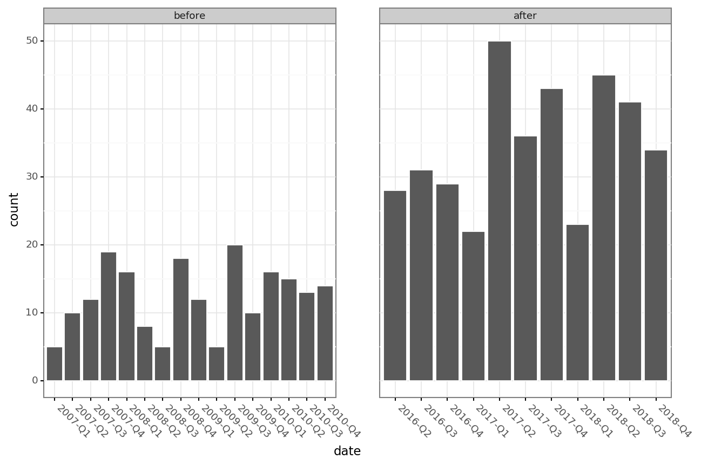

This repo houses traffic accident dates, locations, and severity scores for Ramsey County
in MN. The data was obtained via the Dept. of Public Safety in an attempt to understand if
the [Layfayette Bridge project](https://en.wikipedia.org/wiki/Lafayette_Bridge) has
contributed to an increase in accidents.

Anecdotal evidence (e.g. a daily commute on Hwy 52 from Plato to I-94E) suggests that the
new layout is poorly designed, creating vast differences in speed and no clear
understanding of where to merge.

The data confirm that accidents are occurring on the bridge at a higher rate since the
completion of the project in April 2016.

```
|        |     *date* |            |             | *accidents* |            |
| period |      start |        end | range, days |       count | count/days |
|--------+------------+------------+-------------+-------------+------------|
| before | 2007-01-28 | 2010-12-28 |        1430 |         198 |      0.138 |
| after  | 2016-04-03 | 2018-12-20 |         991 |         382 |      0.385 |
```


